<a href="https://github.com/sponsors/TheNolle?frequency=recurring&sponsor=TheNolle">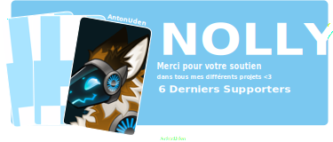</a>


<div align="center" style="display: flex; flex-wrap: wrap; justify-content: center; align-items: center; gap: 20px; margin-top: 40px;">
  <a href="https://discord.com/invite/JYDzHfgmrP">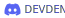</a>
  <a href="https://ko-fi.com/nolly_">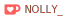</a>
  <a href="https://github.com/sponsors/TheNolle?frequency=recurring&sponsor=TheNolle">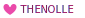</a>
  <a href="https://thenolle.com">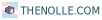</a>
</div>

<div align="center" style="display: flex; flex-wrap: wrap; justify-content: center; align-items: center; gap: 20px; margin-top: 20px;">
  <a href="./README.md">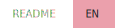</a>
  <a href="./README-FR.md">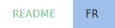</a>
</div>

<h2>🏳️‍⚧️ Un peu plus sur moi..</h2>

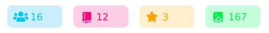

<div style="margin-top: 10px">
  <p style="margin: 0">Salut, Je suis <b>Nolly</b>, un.e développeur.euse non-binaire (apogenre) qui utilise principalement le pronom iel/elleux.</p>
  <p style="margin: 0">Je développe avec <b>Node.js, React, Next.js, Fastify, Prisma et Tailwind CSS</b>, en privilégiant la performance, une architecture propre et une maintenabilité à long terme.</p>
  <p style="margin: 0">J'aime les designs minimalistes et cozy, penses en palettes pastel, interfaces sombres, et qui ont juste <b>la</b> bonne vibe.</p>
  <p style="margin: 0">En dehors du code, je me détends avec <b>Minecraft, PUBG et de la musique</b>. Je suis fan d'anime et de K-dramas axés sur les personnages.</p>
  <p style="margin: 0">Je suis profondément attaché.e aux valeurs progressistes et égalitaires et je souhaite créer un monde web inclusif et ouvert à tous. 🏳️‍🌈</p>
</div>

<div style="margin-top: 20px">
  <p style="margin: 0">En ce moment, j'approfondi mes connaissances en TypeScript pour développer mes projets open-source, tout en explorant les architectures backend et ses meilleures pratiques.</p>

```typescript
const Nolly = {
    pronoms: ['he/him', 'she/her', 'they/them'],
    os: ['Windows', 'Linux'],
    langues: {
        confortables: ['TypeScript', 'JavaScript'],
        apprentissage: ['Kotlin', 'SQL'],
        bases: ['Bash', 'Java', 'Python'],
    },
    programmation: {
        backend: ['Node.js', 'Fastify', 'Prisma'],
        frontend: ['Vite', 'React', 'Next.js', 'Tailwind CSS'],
        bases_de_donnees: ['PostgreSQL', 'SQLite', 'MySQL'],
        devOps: ['Docker', 'GitHub Actions'],
    },
    design: {
        style: 'minimaliste & cozy',
        themes: ['palettes pastel', 'thème sombre'],
        outils: ['Paint.net', 'Blockbench', 'Inkscape'],
    },
    interets: {
        jeux_videos: ['Minecraft', 'PUBG', 'No Man\'s Sky'],
        media: ['anime axés sur les personnages', 'K-dramas'],
    },
    valeurs: ['progressistes', 'égalitaires', 'anti-discrimination'],
    focus_actuel: 'construire des systèmes propres, performants et maintenables à long terme',
}
```
</div>


<h2>🏢 Mes Organisations (interactives)</h2>

<table align="center">
  <tr>
    <td align="center">
      <a href="https://github.com/nolly-cafe" target="_blank">
        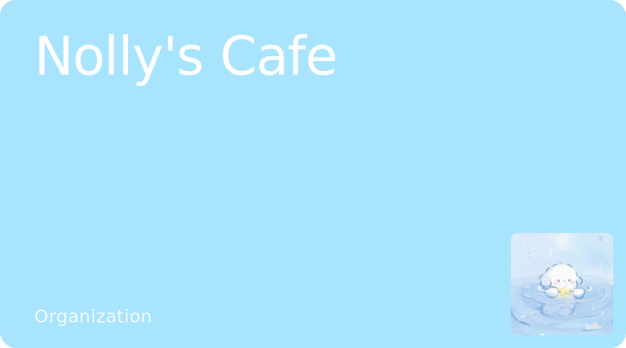
      </a>
    </td>
    <td align="center">
      <a href="https://github.com/novauniverse" target="_blank">
        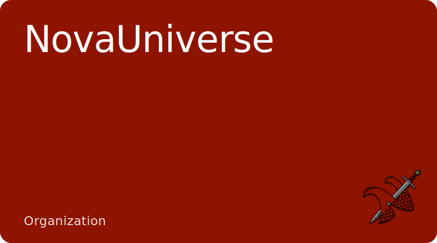
      </a>
    </td>
  </tr>
</table>

> [!NOTE]
> Ce README est une snapshot vivante, mes liens, projets et centres d'intérêt peuvent donc changer au fil du temps.
> Revenez souvent pour voir les mises à jour et les nouveaux projets.


<h2>🍵 Soutenez mon travail</h2>

<div>
  <p style="margin: 0">Si vous appréciez mon travail et souhaitez le soutenir, pensez à me parrainer sur <b>GitHub Sponsors</b> ou à m'offrir un thé sur <b>Ko-fi</b>. Votre soutien me permet de consacrer plus de temps aux projets open source et à la création de contenu.</p>
  <p style="margin: 0">Merci à tous mes sponsors et supporters, vous êtes incroyables ! 💖</p>
</div>

<table style="margin-top: 20px">
  <tr>
    <th align="center">Plateforme</th>
    <th align="center">Lien</th>
  </tr>
  <tr>
    <td align="center">
      Github Sponsors
    </td>
    <td align="center">
      <a href="https://github.com/sponsors/TheNolle?frequency=recurring&sponsor=TheNolle"></a>
    </td>
  </tr>
  <tr>
    <td align="center">
      Ko-fi
    </td>
    <td align="center">
      <a href="https://ko-fi.com/nolly_"></a>
    </td>
  </tr>
</table>

---

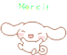