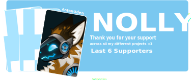

<a href="https://github.com/sponsors/TheNolle?frequency=recurring&sponsor=TheNolle"></a>



<div align="center" style="display: flex; flex-wrap: wrap; justify-content: center; align-items: center; gap: 20px; margin-top: 40px;">
  <a href="https://discord.com/invite/JYDzHfgmrP"></a>
  <a href="https://ko-fi.com/nolly_"></a>
  <a href="https://github.com/sponsors/TheNolle?frequency=recurring&sponsor=TheNolle"></a>
  <a href="https://thenolle.com"></a>
</div>

<div align="center" style="display: flex; flex-wrap: wrap; justify-content: center; align-items: center; gap: 20px; margin-top: 20px;">
  <a href="./README-FR.md"></a>
  <a href="./README.md"></a>
</div>


<h2>🏳️‍⚧️ A little more about me...</h2>


<div style="margin-top: 10px">
  <p style="margin: 0">Hey, I am <b>Nolly</b>, a non-binary (apogender) web developer who goes mainly by they/them pronouns.</p>
  <p style="margin: 0">I build things with <b>Node.js, React, Next.js, Fastify, Prisma, and Tailwind CSS</b>, with a strong focus on performance, clean architecture, and long-term maintainability.</p>
  <p style="margin: 0">I'm drawn to minimalist and cozy design, think pastel palettes, dark UIs, and interfaces that just <b>feel</b> right.</p>
  <p style="margin: 0">Outside of code, I unwind with <b>Minecraft, PUBG, and Music</b>, and I a big fan of character-driven anime and K-dramas.</p>
  <p style="margin: 0">I care deeply about progressive, egalitarian values and building a web that's welcoming to everyone. 🏳️‍🌈</p>
</div>

<div style="margin-top: 20px">
  <p style="margin: 0">At the moment I am learning more about TypeScript for developing my open-source projects, as well as exploring backend architectures and best practices.</p>

```typescript
const Nolly = {
    pronouns: ['he/him', 'she/her', 'they/them'],
    os: ['Windows', 'Linux'],
    languages: {
        comfortable: ['TypeScript', 'JavaScript'],
        learning: ['Kotlin', 'SQL'],
        basics: ['Bash', 'Java', 'Python'],
    },
    programming: {
        backend: ['Node.js', 'Fastify', 'Prisma'],
        frontend: ['Vite', 'React', 'Next.js', 'Tailwind CSS'],
        databases: ['PostgreSQL', 'SQLite', 'MySQL'],
        devOps: ['Docker', 'GitHub Actions'],
    },
    design: {
        style: 'minimalist & cozy',
        themes: ['pastel palettes', 'dark mode'],
        tools: ['Paint.net', 'Blockbench', 'Inkscape'],
    },
    interests: {
        games: ['Minecraft', 'PUBG', 'No Man\'s Sky'],
        media: ['character-driven anime', 'K-dramas'],
    },
    values: ['progressive', 'egalitarian', 'anti-discrimination'],
    currentFocus: 'building clean, performant, long-term maintainable systems',
}
```
</div>


<h2>🏢 My Organizations (interactible)</h2>

<table align="center">
  <tr>
    <td align="center">
      <a href="https://github.com/nolly-cafe" target="_blank">
        
      </a>
    </td>
    <td align="center">
      <a href="https://github.com/novauniverse" target="_blank">
        
      </a>
    </td>
  </tr>
</table>

> [!NOTE]
> This README is a living snapshot so links, projects, and focus areas may change as I build and grow.  
> Check back often for updates and new projects.


<h2>🍵 Support My Work</h2>

<div>
  <p style="margin: 0">If you like what I do and want to support my work, consider sponsoring me on <b>GitHub Sponsors</b> or buying me a tea on <b>Ko-fi</b>. Your support helps me dedicate more time to open-source projects and creating content.</p>
  <p style="margin: 0">Thank you to all my current sponsors and supporters, you are amazing! 💖</p>
</div>

<table style="margin-top: 20px">
  <tr>
    <th align="center">Platform</th>
    <th align="center">Link</th>
  </tr>
  <tr>
    <td align="center">
      Github Sponsors
    </td>
    <td align="center">
      <a href="https://github.com/sponsors/TheNolle?frequency=recurring&sponsor=TheNolle"></a>
    </td>
  </tr>
  <tr>
    <td align="center">
      Ko-fi
    </td>
    <td align="center">
      <a href="https://ko-fi.com/nolly_"></a>
    </td>
  </tr>
</table>

---

